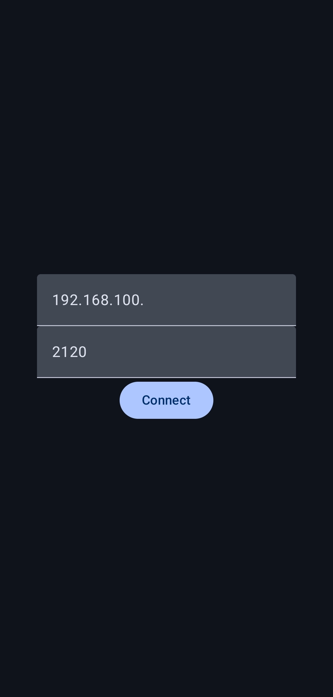

# Remote Input

A simple way to control a computer in the local network.

The computer you want to control needs to have the daemon running,
then you need to find out what ip that computer has,
then you enter the computer ip in the client application.

# Daemon

## Linux

Is working on Wayland and Xorg!

Is using uinput for creating the virtual device

# Client

## Android

Application is only for aarch64 android

If the connection was made the next screen will show!

In the top part is a touchpad and in the bottom part is the input field, the recommanded keyboard layout is EN_US.

- press = left click
- double tap = double click
- long press = right click

Drag is not working!

# Build

## Daemon

`zig build`

And the output is in `zig-out/bin/remote-input-server`

## Android

`scripts/prep_android.sh`

Then open Android Studio with the project from `./android`

The app can only be build for aarch64!

